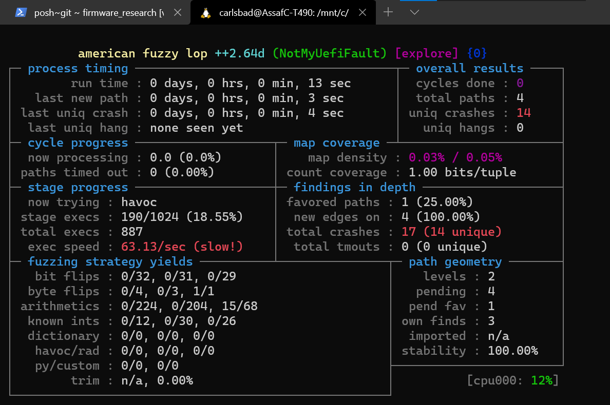

# NotMyUefiFault

A buggy UEFI application to be used as a sanity test for `efi_fuzz`.\
Works by reading an NVRAM variable called `FaultType`, and based on its value deliberately generates a specific bug class.

## Fault types

Below is a curated list of possible values for the `FaultType` variable:

| Numeric value | Symbolic name                      | Explanation                                                                              |   |
|---------------|------------------------------------|------------------------------------------------------------------------------------------|---|
| 1             | POOL_OVERFLOW_COPY_MEM             | Triggers a pool overflow from BS->CopyMem()                                              |   |
| 2             | POOL_UNDERFLOW_COPY_MEM            | Triggers a pool underflow from BS->CopyMem()                                             |   |
| 3             | POOL_OVERFLOW_SET_MEM              | Triggers a pool overflow from BS->SetMem()                                               |   |
| 4             | POOL_UNDERFLOW_SET_MEM             | Triggers a pool underflow from BS->SetMem()                                              |   |
| 5             | POOL_OVERFLOW_USER_CODE            | Triggers a pool overflow from user code                                                  |   |
| 6             | POOL_UNDERFLOW_USER_CODE           | Triggers a pool underflow from user code                                                 |   |
| 7             | POOL_OOB_READ_AHEAD                | Triggers an out-of-bounds read ahead of the pool buffer                                  |   |
| 8             | POOL_OOB_READ_BEHIND               | Triggers an out-of-bounds read behind the pool buffer                                    |   |
| 9             | POOL_DOUBLE_FREE                   | Frees the same pool block twice in a row                                                 |   |
| 10            | POOL_INVALID_FREE                  | Frees a pointer which wasn't allocated by BS->AllocatePool()                             |   |
| 11            | POOL_UAF_READ                      | Reads from a pool buffer after it was freed                                              |   |
| 12            | POOL_UAF_WRITE                     | Writes to the pool buffer after it was freed                                             |   |
| 13            | NULL_DEREFERENCE_DETERMINISTIC     | Writes to the NULL page                                                                  |   |
| 14            | NULL_DEREFERENCE_NON_DETERMINISTIC | Allocates a buffer with BS->AllocatePool(), then uses it without checking for NULL first |   |
| 15            | STACK_BUFFER_OVERFLOW              | Generates a stack-based buffer overflow                                                  |   |

## Fuzzing

1. Create a directory with the fuzzing seeds:\
`mkdir -p afl_inputs/FaultType`\
`echo -ne "\xFF\xFF\xFF\xFF" > afl_inputs/FaultType/FaultType_0`
2. Fire off the fuzzer:\
`afl-fuzz -T NotMyUefiFault -i afl_inputs/FaultType/ -o afl_outputs/ -U -- python efi_fuzz.py NotMyUefiFault/bin/NotMyUefiFault.efi nvram.pickle FaultType @@`

## Build instructions
1. Clone and build EDK2. A Detailed walkthrough for Windows can be found [here](https://github.com/tianocore/tianocore.github.io/wiki/Windows-systems).
2. Execute `edk2\edksetup.bat`
2. Copy `src\NotMyUefiFaultPkg` to the `edk2` base dir
3. Edit the `edk2\Conf/target.txt` file:\
    3.1. Set `ACTIVE_PLATFORM = MdeModulePkg/MdeModulePkg.dsc`\
    3.2. Set `TARGET_ARCH = X64`\
    3.3. Set `TOOL_CHAIN_TAG = VS2019`
4. Add the entry `NotMyUefiFaultPkg/NotMyUefiFault.inf` to the `[components]` section of `edk2\MdeModulePkg/MdeModulePkg.dsc`
5. Execute `build`, the binaries should be at `edk2\MdeModule\DEBUG_VS2019\X64\NotMyUefiFaultPkg\NotMyUefiFault\OUTPUT`